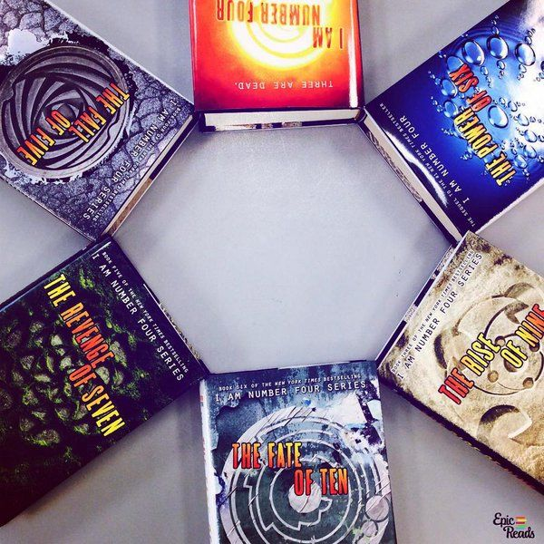

<html>
<head>
  <meta charset="utf-8">
  <meta name="viewport" content="width=device-width, initial-scale=1, shrink-to-fit=no">
  <!-- Bootstrap CSS file -->
  <link rel="stylesheet" href="https://stackpath.bootstrapcdn.com/bootstrap/4.3.1/css/bootstrap.min.css" integrity="sha384-ggOyR0iXCbMQv3Xipma34MD+dH/1fQ784/j6cY/iJTQUOhcWr7x9JvoRxT2MZw1T" crossorigin="anonymous">
  <!-- Font Awesome CSS -->
  <link rel="stylesheet" href="https://stackpath.bootstrapcdn.com/font-awesome/4.7.0/css/font-awesome.min.css" integrity="sha384-wvfXpqpZZVQGK6TAh5PVlGOfQNHSoD2xbE+QkPxCAFlNEevoEH3Sl0sibVcOQVnN" crossorigin="anonymous">
  <link rel="stylesheet" type="text/css" href="public/hStyle.css">
  
</head>

<body onresize="getHeight()">

  <!--navigation bar-->
  <nav class="navbar navbar-expand-md sticky-top" id="navbar-custom">
    
    <button type="button" class="navbar-toggler btn-outline-secondary" data-toggle="collapse" data-target="#navbarCollapse">
      
    </button>

    <!--collapsible navigation bar for mobile devices-->
    

      

        <a href="index.html" class="nav-item nav-link">Home</a>
        <a href="Characters.html" class="nav-item nav-link">Character List</a>
        <a href="Books.html" class="nav-item nav-link">Books in the Series</a>
        <a href="Quiz.html" class="nav-item nav-link">Find Out Your Legacy</a>
      

    

  </nav>

  

    <video id="headerVid" autoplay muted loop>
      <source src="public/backgroundvid.mp4" type="video/mp4">
    </video>
  

  

    

      

        <h1 id="homeTitle">THE Lorien Legacies</h1>
      

    

    <!-- the home content is placed within the header overlay for smooth
    opacity and scrolling effects -->
    

      

        

          <h1>Three of us are dead</h1>
          <h1 id="num4">I am Number Four.</h1>
        

      

      <!--contains images which are links to other pages on the website -->
      

        

          

            

              
              <a href="Characters.html">
                
CHARACTERS

              </a>
            

            

              
              <a href="Books.html">
                
BOOKS

              </a>
            

            

              
              <a href="Quiz.html">
                
LEGACY

              </a>
            

          

        

      

    

  

  <!-- linked personal and Boostrap js files -->
  
  
  
  
</body>
</html>
